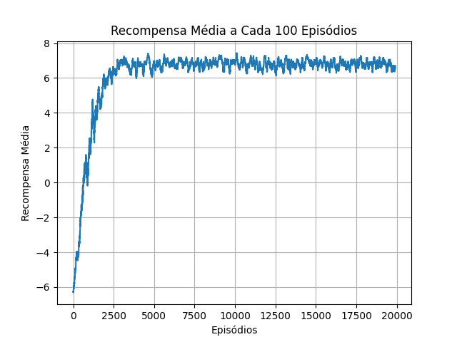
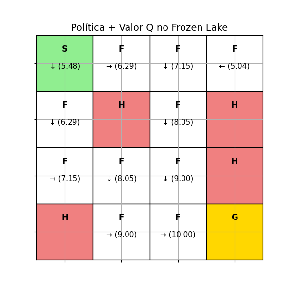
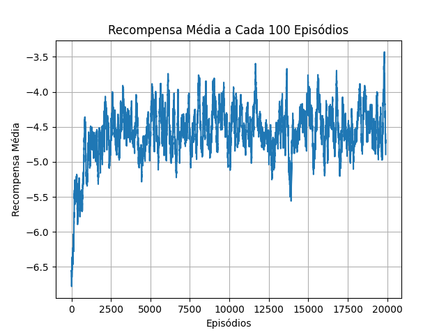
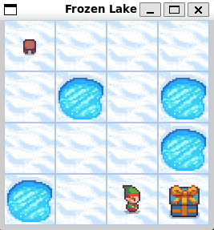

# Aplicação do Q-Learning no Frozen Lake

## Equipe

* Cristian Prochnow
* Gustavo Henrique Dias
* Lucas Willian de Souza Serpa
* Marlon de Souza
* Ryan Gabriel Mazzei Bromati

## Parâmetros do Q-Learning

- **alpha = 0.1**  
    - Taxa de aprendizado: define o quanto o agente aprende de novas informações.

- **gamma = 0.95**  
    - Fator de desconto: indica o quanto o agente valoriza recompensas futuras (próximo de 1 valoriza mais o futuro).

- **epsilon = 1.0**  
    - Taxa de exploração inicial: começa tentando explorar ao máximo, de forma aleatória.

- **epsilon_decay = 0.999**  
    - Fator de decaimento do epsilon: reduz a exploração aos poucos conforme o agente aprende.

- **epsilon_min = 0.05**  
    - Valor mínimo de exploração: mesmo depois de muito treino, o agente ainda explora um pouco.

- **num_episodes = 20000**  
    - Número de episódios: total de vezes que o agente tentará resolver o problema do zero.

- **max_steps = 30**  
    - Máximo de passos por episódio: número máximo de ações que o agente pode tomar em cada tentativa.


## Customização das penalidades e recompensas no Frozen Lake

&nbsp;&nbsp;&nbsp;&nbsp;No frozen lake, as recompensas por padrão o jogador não perde pontos ao cair em buracos ou movimentar-se. E ao chegar ao objetivo final ganha apenas 1 ponto. Para podermos testar com uma maior aleatoriedade criamos uma classe que nos permite alterar os valores de recompensas e / ou penalidade, conforme ilustrado a seguir:

```python

class CustomRewardWrapper(gym.Wrapper):
    def __init__(self, env, reward_goal=10, reward_hole=-3, reward_step=-0.50):
        super().__init__(env)
        self.reward_goal = reward_goal
        self.reward_hole = reward_hole
        self.reward_step = reward_step

    def step(self, action):
        obs, reward, terminated, truncated, info = self.env.step(action)
        desc = self.unwrapped.desc
        row, col = divmod(obs, desc.shape[1])
        tile = desc[row][col].decode()

        if tile == 'G':
            reward = self.reward_goal
        elif tile == 'H':
            reward = self.reward_hole
        else:
            reward = self.reward_step

        return obs, reward, terminated, truncated, info

```

## Representações visuais

- **Média das pontuações quando is slippery é Falso:**

<div align='center'>



</div>


- **Mapa de Caminho Aprendido com Q-Learning quando is slippery é Falso:**

<div align='center'>



</div>

- **Média das pontuações quando is slippery é True:**

<div align='center'>



</div>

- **Mapa de Caminho Aprendido com Q-Learning quando is slippery é True:**

<div align='center'>


</div>

- **Simulação com Pygame:**

<div align='center'>



</div>

<div align='center'>


</div>

## Getting Started

Para rodar o processo por completo, inclusive com os gráficos, é necessário instalar em sua máquina o pacote abaixo.
```shell
$ sudo apt install swig
```

Após isso, então basta executar o arquivo `main.py` que todo o restante será executado conforme necessário.
```shell
$ python3 main.py
```
